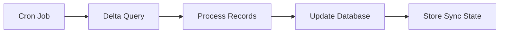

These examples show how AI tools can help you integrate with Emerge more efficiently using the MCP connection.

## Example 1: Generate integration code

**You ask:**
> "Generate TypeScript and Python code to create a signed Emerge link and handle the callback"

**AI response (with MCP connection):**

The AI searches the docs, finds the [Create Links](/link/create-link) and [Callbacks](/link/callbacks) pages, and generates code that keeps `uid` server-side (never user input):

<CodeGroup>

```typescript TypeScript
import express from 'express';
import crypto from 'crypto';

const app = express();

const CLIENT_ID = process.env.EMERGE_CLIENT_ID;
const SIGNING_SECRET = process.env.EMERGE_SIGNING_SECRET;
const REDIRECT_URI = process.env.EMERGE_REDIRECT_URI || 'https://yourapp.com/emerge/callback';

if (!CLIENT_ID || !SIGNING_SECRET) {
  throw new Error('Missing EMERGE_CLIENT_ID or EMERGE_SIGNING_SECRET');
}

const stateStore = new Map<string, { internalUserId: string; createdAt: number }>();
const uidMap = new Map<string, string>();

function createLinkUrl(internalUserId: string): { url: string; state: string } {
  const timestamp = new Date().toISOString();
  const state = crypto.randomBytes(16).toString('hex');

  const params: Record<string, string> = {
    client_id: CLIENT_ID,
    redirect_uri: REDIRECT_URI,
    state,
    timestamp
  };

  // Use your internal user id or omit uid entirely.
  if (internalUserId) {
    params.uid = internalUserId;
  }

  const signatureBase = Object.keys(params)
    .sort()
    .map(key => `${key}=${params[key]}`)
    .join('&');

  const signature = crypto
    .createHmac('sha256', SIGNING_SECRET)
    .update(signatureBase)
    .digest('hex');

  const finalParams = new URLSearchParams(params);
  finalParams.append('signature', signature);

  return { url: `https://link.emergedata.ai/link/start?${finalParams.toString()}`, state };
}

app.get('/emerge/link', (req, res) => {
  try {
    const internalUserId = String(req.query.user_id || '');
    if (!internalUserId) {
      return res.status(400).send('Missing user_id');
    }

    const { url, state } = createLinkUrl(internalUserId);
    stateStore.set(state, { internalUserId, createdAt: Date.now() });

    return res.redirect(url);
  } catch (err) {
    console.error('Failed to create link', err);
    return res.status(500).send('Server error');
  }
});

app.get('/emerge/callback', async (req, res) => {
  try {
    const { status, state, uid, error_code } = req.query as Record<string, string>;
    const record = stateStore.get(state);

    if (!record) {
      return res.status(400).send('Invalid state');
    }

    stateStore.delete(state);

    if (status === 'success' || status === 'reauthorized') {
      if (!uid) {
        return res.status(400).send('Missing uid');
      }

      uidMap.set(record.internalUserId, uid);
      return res.redirect('/dashboard?connected=true');
    }

    const errorMessage = encodeURIComponent(error_code || 'unknown_error');
    return res.redirect(`/connect?error=${errorMessage}`);
  } catch (err) {
    console.error('Callback error', err);
    return res.status(500).send('Server error');
  }
});

app.listen(3000, () => {
  console.log('Server running on http://localhost:3000');
});
```

```python Python
import os
import hmac
import hashlib
import secrets
from datetime import datetime, timezone
from urllib.parse import urlencode

from fastapi import FastAPI, HTTPException
from fastapi.responses import RedirectResponse
import uvicorn

CLIENT_ID = os.getenv('EMERGE_CLIENT_ID')
SIGNING_SECRET = os.getenv('EMERGE_SIGNING_SECRET')
REDIRECT_URI = os.getenv('EMERGE_REDIRECT_URI', 'https://yourapp.com/emerge/callback')

if not CLIENT_ID or not SIGNING_SECRET:
    raise RuntimeError('Missing EMERGE_CLIENT_ID or EMERGE_SIGNING_SECRET')

app = FastAPI()

state_store: dict[str, dict] = {}
uid_map: dict[str, str] = {}


def create_link_url(internal_user_id: str) -> tuple[str, str]:
    timestamp = datetime.now(timezone.utc).isoformat().replace('+00:00', 'Z')
    state = secrets.token_hex(16)

    params = {
        'client_id': CLIENT_ID,
        'redirect_uri': REDIRECT_URI,
        'state': state,
        'timestamp': timestamp
    }

    # Use your internal user id or omit uid entirely.
    if internal_user_id:
        params['uid'] = internal_user_id

    signature_base = '&'.join(f'{k}={v}' for k, v in sorted(params.items()))

    signature = hmac.new(
        SIGNING_SECRET.encode(),
        signature_base.encode(),
        hashlib.sha256
    ).hexdigest()

    params['signature'] = signature
    return f"https://link.emergedata.ai/link/start?{urlencode(params)}", state


@app.get('/emerge/link')
async def emerge_link(user_id: str):
    if not user_id:
        raise HTTPException(status_code=400, detail='Missing user_id')

    url, state = create_link_url(user_id)
    state_store[state] = {
        'internal_user_id': user_id,
        'created_at': datetime.now(timezone.utc).timestamp()
    }

    return RedirectResponse(url)


@app.get('/emerge/callback')
async def emerge_callback(
    status: str,
    state: str,
    uid: str = '',
    error_code: str | None = None
):
    record = state_store.pop(state, None)
    if not record:
        raise HTTPException(status_code=400, detail='Invalid state')

    if status in ('success', 'reauthorized'):
        if not uid:
            raise HTTPException(status_code=400, detail='Missing uid')

        uid_map[record['internal_user_id']] = uid
        return RedirectResponse('/dashboard?connected=true')

    return RedirectResponse(f"/connect?error={error_code or 'unknown_error'}")


if __name__ == '__main__':
    uvicorn.run(app, host='0.0.0.0', port=3000)
```

</CodeGroup>

## Example 2: Understand data availability

**You ask:**
> "What data can I get from Emerge and how soon after consent?"

**AI response:**

The AI finds the [Query Overview](/query/overview) and [Webhooks](/link/webhooks) pages:

- Data is available **after export completes**. The export typically finishes in minutes and you receive an `export.completed` webhook when it is ready.
- Until you receive the webhook, sync queries may return empty results. Handle this gracefully and retry with backoff.

## Example 3: Debug a webhook signature issue

**You ask:**
> "My webhook signature verification is failing. What am I doing wrong?"

**AI response:**

The AI checks [Webhooks](/link/webhooks) and points out the most common issues:

1. **Raw body required** - sign the raw request body, not parsed JSON.
2. **Header name** - use the `x-emerge-signature` header.
3. **Comparison** - use constant-time comparison to avoid subtle mismatches.

<CodeGroup>

```typescript TypeScript
import express from 'express';
import crypto from 'crypto';

const app = express();
app.use(express.raw({ type: 'application/json' }));

const WEBHOOK_SECRET = process.env.EMERGE_WEBHOOK_SECRET;
if (!WEBHOOK_SECRET) {
  throw new Error('Missing EMERGE_WEBHOOK_SECRET');
}

app.post('/webhooks/emerge', async (req, res) => {
  try {
    const signature = req.header('x-emerge-signature');
    if (!signature) {
      return res.status(401).send('Missing signature');
    }

    const expected = crypto
      .createHmac('sha256', WEBHOOK_SECRET)
      .update(req.body)
      .digest('hex');

    const signatureBuf = Buffer.from(signature, 'hex');
    const expectedBuf = Buffer.from(expected, 'hex');

    if (signatureBuf.length !== expectedBuf.length || !crypto.timingSafeEqual(signatureBuf, expectedBuf)) {
      return res.status(401).send('Invalid signature');
    }

    const payload = JSON.parse(req.body.toString('utf8'));
    const { event, data } = payload;

    console.log(`Received ${event} for uid ${data?.uid}`);
    return res.status(200).send('OK');
  } catch (err) {
    console.error('Webhook error', err);
    return res.status(500).send('Server error');
  }
});

app.listen(3001, () => {
  console.log('Webhook listener running on http://localhost:3001');
});
```

```python Python
import os
import hmac
import hashlib
import json

from fastapi import FastAPI, HTTPException, Request
import uvicorn

app = FastAPI()

WEBHOOK_SECRET = os.getenv('EMERGE_WEBHOOK_SECRET')
if not WEBHOOK_SECRET:
    raise RuntimeError('Missing EMERGE_WEBHOOK_SECRET')


@app.post('/webhooks/emerge')
async def emerge_webhook(request: Request):
    signature = request.headers.get('x-emerge-signature')
    if not signature:
        raise HTTPException(status_code=401, detail='Missing signature')

    body = await request.body()
    expected = hmac.new(
        WEBHOOK_SECRET.encode(),
        body,
        hashlib.sha256
    ).hexdigest()

    if not hmac.compare_digest(signature, expected):
        raise HTTPException(status_code=401, detail='Invalid signature')

    try:
        payload = json.loads(body)
    except json.JSONDecodeError as exc:
        raise HTTPException(status_code=400, detail='Invalid JSON') from exc

    event = payload.get('event')
    data = payload.get('data', {})
    print(f"Received {event} for uid {data.get('uid')}")

    return {'status': 'ok'}


if __name__ == '__main__':
    uvicorn.run(app, host='0.0.0.0', port=3001)
```

</CodeGroup>

## Example 4: Plan a nightly sync

**You ask:**
> "I want to sync Emerge data to my database nightly. What's the best approach?"

**AI response:**

The AI finds [Pagination](/query/pagination) and [Query Overview](/query/overview):



**Recommended approach:**

- Use **delta queries** with `ingested_begin` to fetch new data since the last run.
- Page with `cursor` until `has_more` is false.
- Store `applied_ingested_end` as your next `ingested_begin`.

<CodeGroup>

```typescript TypeScript
interface SyncState {
  lastIngestedEnd: string;
}

async function deltaSync(uid: string, token: string, state: SyncState): Promise<SyncState> {
  let cursor: string | undefined;
  let appliedEnd = state.lastIngestedEnd;
  const newData: unknown[] = [];

  try {
    do {
      const params = new URLSearchParams({
        uid,
        ingested_begin: appliedEnd
      });

      if (cursor) {
        params.set('cursor', cursor);
      }

      const response = await fetch(
        `https://query.emergedata.ai/v1/sync/get_search?${params.toString()}`,
        { headers: { Authorization: `Bearer ${token}` } }
      );

      if (!response.ok) {
        const body = await response.text();
        throw new Error(`Query failed (${response.status}): ${body}`);
      }

      const result = await response.json();
      newData.push(...(result.data || []));

      appliedEnd = result.applied_ingested_end || appliedEnd;
      cursor = result.has_more ? result.next_cursor : undefined;
    } while (cursor);

    await processNewData(newData);
    return { lastIngestedEnd: appliedEnd };
  } catch (err) {
    console.error('Delta sync failed', err);
    throw err;
  }
}

async function processNewData(records: unknown[]) {
  console.log(`Processing ${records.length} records`);
}

async function runDeltaSync() {
  const token = process.env.EMERGE_API_TOKEN;
  if (!token) {
    throw new Error('Missing EMERGE_API_TOKEN');
  }

  const state = { lastIngestedEnd: '2024-01-01T00:00:00Z' };
  await deltaSync('user_12345', token, state);
}

runDeltaSync().catch(err => {
  console.error(err);
  process.exit(1);
});
```

```python Python
import asyncio
import httpx
from dataclasses import dataclass
from typing import Any


@dataclass
class SyncState:
    last_ingested_end: str


async def delta_sync(uid: str, token: str, state: SyncState) -> SyncState:
    cursor: str | None = None
    applied_end = state.last_ingested_end
    new_data: list[Any] = []

    try:
        async with httpx.AsyncClient(timeout=30) as client:
            while True:
                params = {
                    'uid': uid,
                    'ingested_begin': applied_end
                }
                if cursor:
                    params['cursor'] = cursor

                response = await client.get(
                    'https://query.emergedata.ai/v1/sync/get_search',
                    params=params,
                    headers={'Authorization': f'Bearer {token}'}
                )
                response.raise_for_status()

                result = response.json()
                new_data.extend(result.get('data', []))

                applied_end = result.get('applied_ingested_end', applied_end)
                if not result.get('has_more'):
                    break
                cursor = result.get('next_cursor')

        await process_new_data(new_data)
        return SyncState(last_ingested_end=applied_end)
    except httpx.HTTPError as exc:
        raise RuntimeError(f'Delta sync failed: {exc}') from exc


async def process_new_data(records: list[Any]):
    print(f'Processing {len(records)} records')


if __name__ == '__main__':
    async def main():
        state = SyncState(last_ingested_end='2024-01-01T00:00:00Z')
        await delta_sync('user_12345', 'your_api_token', state)

    asyncio.run(main())
```

</CodeGroup>

## Example 5: Choose sync vs async for mobile

**You ask:**
> "Should I use sync or async queries for my mobile app?"

**AI response:**

For mobile apps, **sync queries are recommended** because they return JSON immediately and are simpler to integrate. Your mobile app should call **your backend**, not the Query API directly.

<CodeGroup>

```typescript TypeScript
async function getSearchHistory(uid: string, token: string) {
  try {
    const response = await fetch(
      `https://query.emergedata.ai/v1/sync/get_search?uid=${encodeURIComponent(uid)}`,
      { headers: { Authorization: `Bearer ${token}` } }
    );

    if (!response.ok) {
      const body = await response.text();
      throw new Error(`Query failed (${response.status}): ${body}`);
    }

    return await response.json();
  } catch (err) {
    console.error('Search history query failed', err);
    throw err;
  }
}

async function runQuery() {
  const token = process.env.EMERGE_API_TOKEN;
  if (!token) {
    throw new Error('Missing EMERGE_API_TOKEN');
  }

  const data = await getSearchHistory('user_12345', token);
  console.log(data);
}

runQuery().catch(err => {
  console.error(err);
  process.exit(1);
});
```

```python Python
import asyncio
import httpx


async def get_search_history(uid: str, token: str) -> dict:
    try:
        async with httpx.AsyncClient(timeout=30) as client:
            response = await client.get(
                'https://query.emergedata.ai/v1/sync/get_search',
                params={'uid': uid},
                headers={'Authorization': f'Bearer {token}'}
            )
            response.raise_for_status()
            return response.json()
    except httpx.HTTPError as exc:
        raise RuntimeError(f'Search history query failed: {exc}') from exc


if __name__ == '__main__':
    async def main():
        data = await get_search_history('user_12345', 'your_api_token')
        print(data)

    asyncio.run(main())
```

</CodeGroup>

## Try it yourself

Set up the MCP connection and ask:

- "How do I implement retry logic for Emerge API calls?"
- "What happens if a user revokes consent?"
- "Generate a React component that shows a Connect Data button"
- "Show the correct way to handle uid without asking the user"

See [MCP Setup](/ai/mcp-setup) to connect your AI tool.
