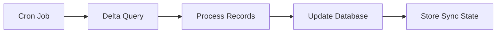

These examples show how AI tools can help you integrate with Emerge more efficiently using the MCP connection.

## Example 1: Generate integration code

**You ask:**
> "Generate TypeScript code to create a signed Emerge link and handle the callback"

**AI response (with MCP connection):**

The AI searches the docs, finds the [Create Links](/link/create-link) and [Callbacks](/link/callbacks) pages, and generates:

```typescript
import crypto from 'crypto';
import express from 'express';

// Create signed link
function createEmergeLink(userId: string): string {
  const timestamp = Math.floor(Date.now() / 1000).toString();
  const state = crypto.randomBytes(16).toString('hex');

  const params = {
    client_id: process.env.EMERGE_CLIENT_ID!,
    redirect_uri: 'https://yourapp.com/emerge/callback',
    state,
    timestamp,
    uid: userId,
    flow_version: 'lm'
  };

  const sortedKeys = Object.keys(params).sort();
  const signatureBase = sortedKeys
    .map(key => `${encodeURIComponent(key)}=${encodeURIComponent(params[key])}`)
    .join('&');

  const signature = crypto
    .createHmac('sha256', process.env.EMERGE_CLIENT_SECRET!)
    .update(signatureBase)
    .digest('hex');

  return `https://link.emergedata.ai/link?${signatureBase}&signature=${signature}`;
}

// Handle callback
const app = express();

app.get('/emerge/callback', (req, res) => {
  const { status, state, uid, error_code } = req.query;

  if (status === 'success' || status === 'reauthorized') {
    // Data export starts automatically
    res.redirect('/dashboard?connected=true');
  } else {
    res.redirect(`/error?code=${error_code}`);
  }
});
```

## Example 2: Understand data availability

**You ask:**
> "What data can I get from Emerge and how soon after consent?"

**AI response:**

The AI finds the [Query Overview](/query/overview) and [Webhooks](/link/webhooks) pages:

| Data Type | Available After | Typical Volume |
|-----------|----------------|----------------|
| Search History | 1-15 minutes | 100s-1000s of queries |
| Browsing History | 1-15 minutes | 1000s-10000s of visits |
| YouTube History | 1-15 minutes | 100s of videos |
| Ad Interactions | 1-15 minutes | 10s-100s of interactions |

You'll receive an `export.completed` webhook when data is ready. Until then, queries return empty results.

## Example 3: Debug an integration issue

**You ask:**
> "My webhook signature verification is failing. The signature header doesn't match what I compute."

**AI response:**

The AI searches the [Webhooks](/link/webhooks) page and identifies common issues:

1. **Raw body issue**: Make sure you're verifying against the raw request body, not parsed JSON:

```typescript
// Wrong - parsed body
const signature = hmac(JSON.stringify(req.body));

// Correct - raw body
app.use(express.raw({ type: 'application/json' }));
const signature = hmac(req.body); // Buffer
```

2. **Encoding mismatch**: Ensure you're comparing hex strings:

```typescript
const expected = crypto
  .createHmac('sha256', WEBHOOK_SECRET)
  .update(rawBody)
  .digest('hex'); // Must be hex, not base64
```

3. **Secret configuration**: Verify `WEBHOOK_SECRET` is the correct value from Control Room → Settings → Webhooks.

## Example 4: Plan an architecture

**You ask:**
> "I want to sync Emerge data to my database nightly. What's the best approach?"

**AI response:**

The AI finds [Pagination](/query/pagination) and [Query Overview](/query/overview):

**Recommended architecture:**



1. **Use async queries** for large datasets (no timeout)
2. **Implement delta sync** with `ingested_after` parameter
3. **Store sync state** to resume from last position

```python
# Nightly sync job
async def nightly_sync():
    state = await load_sync_state()

    for user in await get_consented_users():
        # Start async job
        task = await start_query(user.uid, ingested_after=state.last_sync)

        # Poll for completion
        while True:
            result = await get_job_status(task.id)
            if result.status == 'completed':
                await save_to_database(user.uid, result.data)
                break
            await asyncio.sleep(5)

    await save_sync_state(datetime.utcnow())
```

## Example 5: Compare options

**You ask:**
> "Should I use sync or async queries for my mobile app?"

**AI response:**

The AI finds [Query Overview](/query/overview):

For mobile apps, **sync queries are recommended**:

| Factor | Sync | Async |
|--------|------|-------|
| Latency | Immediate response | Requires polling |
| Complexity | Single request | Multiple requests |
| Error handling | Standard HTTP | Job state management |
| Timeout risk | 30s limit | None |

**Use sync unless:**
- You're fetching > 1000 records at once
- The 30-second timeout is insufficient
- You're processing in background

For mobile, users expect immediate responses, so sync fits better:

```swift
// Swift example for iOS
func fetchSearchHistory() async throws -> [SearchEntry] {
    let url = URL(string: "https://query.emergedata.ai/v1/sync/get_search?uid=\(userId)")!
    var request = URLRequest(url: url)
    request.setValue("Bearer \(apiToken)", forHTTPHeaderField: "Authorization")

    let (data, _) = try await URLSession.shared.data(for: request)
    return try JSONDecoder().decode(SearchResponse.self, from: data).data
}
```

## Try it yourself

Set up the MCP connection and ask:

- "How do I implement retry logic for Emerge API calls?"
- "What happens if a user revokes consent?"
- "Generate a React component that shows a Connect Data button"

See [MCP Setup](/ai/mcp-setup) to connect your AI tool.
