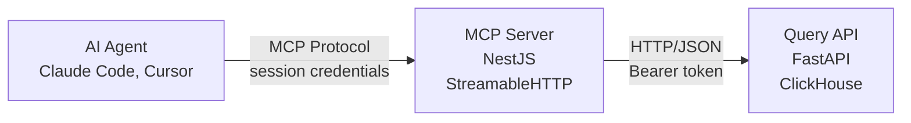

The Query API MCP server gives AI agents (Claude, Cursor, VS Code) secure access to consented user data. Instead of making direct HTTP calls, AI tools use the Model Context Protocol with session-based credentials.

<Note>
**Different from Docs MCP**: This server queries **user data**. For documentation search, see [Docs MCP Setup](/ai/mcp-docs-setup).
</Note>

## Architecture



The MCP server is a thin wrapper around Query API sync endpoints:

| Feature | MCP Server | Direct HTTP |
|---------|------------|-------------|
| **Protocol** | MCP (JSON-RPC over HTTP) | REST API |
| **Credentials** | Session-based (provide once) | Per-request (Bearer token) |
| **Tool Discovery** | Built-in (`tools/list`) | OpenAPI spec |
| **Ship with MCP** | Native support | Manual implementation |
| **Best For** | AI agents, IDE plugins | Server-to-server, custom apps |

## Prerequisites

<Check>Control Room account with API credentials</Check>
<Check>At least one user with granted consent</Check>

Don't have credentials? [Sign up here](https://dashboard.emergedata.ai).

## MCP Server URL

```
https://mcp.emergedata.ai/mcp
```

**Authentication**: Session-based credentials passed via URL parameters during initialization.

## Setup by Tool

<Tabs>
  <Tab title="Claude Code">
    ### Add MCP Server

    ```bash
    claude mcp add emerge-query "https://mcp.emergedata.ai/mcp?auth_token=YOUR_TOKEN&uid=YOUR_UID"
    ```

    ### Verify Connection

    ```bash
    claude mcp list
    ```

    You should see:
    ```
    emerge-query: https://mcp.emergedata.ai/mcp (connected)
    ```

    ### Usage

    Now you can query user data:

    ```bash
    claude "Get search history for psub_c3d4e5f6789012345678901234abcdef from the last week"
    ```

    Claude Code will:
    1. Call the `get_search_data` tool
    2. Apply date range filters
    3. Return formatted results
  </Tab>

  <Tab title="Claude Desktop">
    ### Add MCP Server

    1. Open Claude desktop app
    2. Go to **Settings** → **Connectors**
    3. Click **Add custom connector**
    4. Enter configuration:
       - **Name**: Emerge Query API
       - **URL**: `https://mcp.emergedata.ai/mcp`
    5. Add connection parameters:
       ```
       ?auth_token=YOUR_API_TOKEN&uid=YOUR_USER_ID
       ```
    6. Click **Save**

    ### Usage

    Now you can ask Claude to query user data:
    - "Get search history for the last week"
    - "What YouTube videos has this user watched?"
    - "Show me browsing history filtered by Shopping category"

    Claude will automatically call the appropriate MCP tools and format the results.
  </Tab>

  <Tab title="Cursor">
    ### Configuration File

    Create or edit `.cursor/mcp.json` in your project root:

    ```json
    {
      "mcpServers": {
        "Emerge Query": {
          "url": "https://mcp.emergedata.ai/mcp?auth_token=YOUR_TOKEN&uid=YOUR_USER_ID"
        }
      }
    }
    ```

    <Warning>
    **Security**: Never commit credentials to git. Use environment variables:
    ```json
    {
      "mcpServers": {
        "Emerge Query": {
          "url": "https://mcp.emergedata.ai/mcp?auth_token=${EMERGE_TOKEN}&uid=${EMERGE_UID}"
        }
      }
    }
    ```
    </Warning>

    ### Usage

    In Cursor's AI chat, ask questions about user data:

    ```
    @Emerge Query Show me search patterns for the last month
    ```

    Cursor will:
    1. Query the MCP server
    2. Receive structured data
    3. Analyze and present insights
  </Tab>

  <Tab title="VS Code">
    ### MCP Configuration

    Create `.vscode/mcp.json` in your workspace:

    ```json
    {
      "servers": {
        "Emerge Query": {
          "type": "http",
          "url": "https://mcp.emergedata.ai/mcp?auth_token=YOUR_TOKEN&uid=YOUR_UID"
        }
      }
    }
    ```

    ### With GitHub Copilot

    If using Copilot Chat, the MCP connection provides:
    - Direct access to user data via natural language
    - Structured queries with proper filtering
    - Context-aware code generation

    ### With Other AI Extensions

    Any VS Code AI extension supporting MCP can use this configuration.
  </Tab>
</Tabs>

### Verify Connection

After configuration, test the health endpoint:

```bash
curl https://mcp.emergedata.ai/mcp/health

# Expected response
{
  "status": "ok",
  "service": "mcp-server",
  "version": "1.0.0",
  "protocol": "streamable-http"
}
```

## Session Credentials

The MCP server uses **session-based credentials** — provide them once on connection, and all tool calls use them automatically.

| Credential | Purpose | Example |
|------------|---------|---------|
| `auth_token` | API authentication token from Control Room | `tok_abc123...` |
| `uid` | User reference ID from consent callback | `psub_c3d4e5f6789012345678901234abcdef` |

You can override session credentials for individual tool calls by passing `auth_token` and `uid` as tool parameters.

### Security Best Practices

<Check>Never commit credentials to git repositories</Check>
<Check>Use environment variables in configuration files</Check>
<Check>Rotate API tokens regularly via Control Room</Check>
<Check>Use unique `uid` per user (don't share across users)</Check>

## Available Tools

The MCP server exposes 5 tools that map 1:1 to Query API sync endpoints:

| MCP Tool | Query API Endpoint | Data Type |
|----------|-------------------|-----------|
| `get_search_data` | `/v1/sync/get_search` | Search history |
| `get_youtube_data` | `/v1/sync/get_youtube` | YouTube watch history |
| `get_browsing_data` | `/v1/sync/get_browsing` | Web browsing |
| `get_ads_data` | `/v1/sync/get_ads` | Ad interactions |
| `get_receipts_data` | `/v1/sync/get_receipts` | Purchase receipts |

See [MCP Query Tools](/ai/mcp-query-tools) for detailed parameter and response documentation.

## Response Format

All tools return the same structure:

```json
{
  "success": true,
  "count": 10,
  "has_more": true,
  "next_cursor": "eyJsYXN0X2V2ZW50X2lkIjoxMjM0NX0=",
  "applied_ingested_end": "2024-01-15T10:30:00Z",
  "data": [
    // ... event objects
  ]
}
```

## Pagination

Use cursor-based pagination for large datasets:

```typescript
let cursor = null;
let allData = [];

do {
  const result = await use_mcp_tool({
    tool: "get_search_data",
    arguments: {
      begin: "2024-01-01T00:00:00Z",
      limit: 1000,
      cursor: cursor
    }
  });

  allData.push(...result.data);
  cursor = result.next_cursor;
} while (result.has_more);
```

See [Pagination Guide](/query/pagination) for best practices.

## Error Handling

When a tool call fails, it returns:

```json
{
  "isError": true,
  "content": [
    {
      "type": "text",
      "text": "Detailed error message"
    }
  ]
}
```

Common errors:
- **401 Unauthorized**: Invalid or missing credentials
- **400 Bad Request**: Invalid parameters (e.g., malformed timestamp)
- **500 Internal Server Error**: Query API or database error

## Example Queries

<CodeGroup>
```text Claude
"Get search history for psub_c3d4e5f6789012345678901234abcdef from the last 7 days filtered by Shopping category"
```

```text Cursor
"Show me the most recent YouTube videos watched by this user, grouped by category"
```

```text Claude Code
"Retrieve browsing history with pagination, starting from cursor abc123, limit 500"
```
</CodeGroup>

The AI agent will:
1. Parse your natural language query
2. Select the appropriate MCP tool
3. Apply filters and parameters
4. Return formatted results

## Troubleshooting

<AccordionGroup>
  <Accordion title="Tool calls fail with 401 Unauthorized">
    **Cause**: Invalid or missing credentials

    **Solutions**:
    - Verify `auth_token` is correct from Control Room
    - Check that user has granted consent (callback `status=success`)
    - Ensure credentials are in the connection URL
    - Try refreshing/rotating your API token
  </Accordion>

  <Accordion title="Empty data arrays returned">
    **Cause**: No data available for query

    **Solutions**:
    - Data export may still be processing (poll `GET /export/status/{uid}` and wait for provider `data_ready: true`)
    - User may not have data for the requested type
    - Check time filters (`begin`/`end`) aren't excluding all data
    - Verify `category` filter isn't too restrictive
  </Accordion>

  <Accordion title="Connection timeout">
    **Cause**: Cannot reach MCP server

    **Solutions**:
    - Verify MCP server URL is exactly `https://mcp.emergedata.ai/mcp`
    - Check firewall/network settings allow HTTPS outbound
    - Test health endpoint: `curl https://mcp.emergedata.ai/mcp/health`
    - Contact support if server appears down
  </Accordion>

  <Accordion title="Tools not appearing in AI tool">
    **Cause**: MCP connection not established

    **Solutions**:
    - Restart your AI tool after adding configuration
    - Verify config file is in the correct location
    - Check file permissions (must be readable)
    - Review AI tool logs for MCP connection errors
  </Accordion>
</AccordionGroup>

## Rate Limits

The MCP server inherits rate limits from the Query API:

- **Requests**: 100 requests per minute per auth token
- **Data**: 10,000 events per request (recommended: 1000)
- **Concurrent**: 10 simultaneous connections per organization

Exceeding limits returns HTTP 429 errors. Contact support for higher limits.

## Source Code

The MCP server is open-source:

- **Repository**: [github.com/emerge-protocol/emgcp](https://github.com/emerge-protocol/emgcp)
- **Issues**: [Report bugs or request features](https://github.com/emerge-protocol/emgcp/issues)
- **License**: MIT

## Next Steps

<CardGroup cols={2}>
  <Card title="Tool Reference" icon="wrench" href="/ai/mcp-query-tools">
    Detailed documentation for all 5 tools
  </Card>
  <Card title="Query Guide" icon="database" href="/query/overview">
    Learn about sync vs async queries
  </Card>
  <Card title="Examples" icon="play" href="/ai/examples">
    See AI workflow examples
  </Card>
  <Card title="Webhooks" icon="webhook" href="/link/webhooks">
    Track consent lifecycle changes
  </Card>
</CardGroup>
