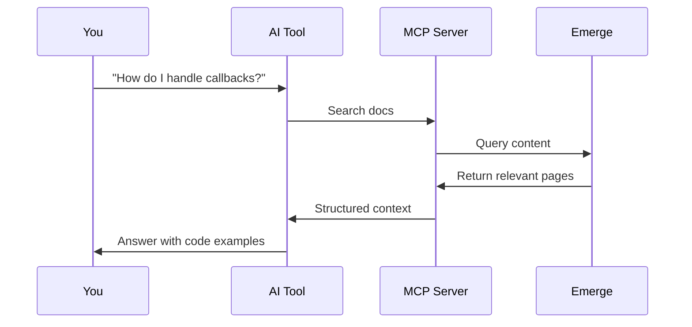

Emerge provides two MCP (Model Context Protocol) servers for different purposes. Connect your AI tools to search documentation, query user data, or both.

## Two MCP Servers

<CardGroup cols={2}>
  <Card title="Docs MCP Server" icon="book" href="/ai/mcp-docs-setup">
    **Search and query this documentation**

    - Semantic documentation search
    - API reference lookup
    - Code example retrieval
    - Best for: Learning the API, troubleshooting
  </Card>
  <Card title="Query MCP Server" icon="database" href="/ai/mcp-query-setup">
    **Query consented user data via AI tools**

    - Search history, browsing, YouTube, ad interactions, receipts
    - Session-based credentials
    - Direct data access for AI agents
    - Best for: Building AI applications with user data
  </Card>
</CardGroup>

| Server | Purpose | URL | Auth Required |
|--------|---------|-----|---------------|
| **Docs MCP** | Search documentation | `https://docs.emergedata.ai/mcp` | No |
| **Query MCP** | Query user data | `https://mcp.emergedata.ai/mcp` | Yes (API token + uid) |

Both use the same Model Context Protocol and work with Claude, Cursor, VS Code, and Claude Code.

## Quick setup

<Tabs>
  <Tab title="Docs MCP">
    Add documentation search to your AI tool:

    ```bash
    # Claude Code
    claude mcp add emerge https://docs.emergedata.ai/mcp
    ```

    ```json
    // Cursor (.cursor/mcp.json)
    {
      "mcpServers": {
        "Emerge": {
          "url": "https://docs.emergedata.ai/mcp"
        }
      }
    }
    ```

    See [Docs MCP Setup](/ai/mcp-docs-setup) for all tools.
  </Tab>
  <Tab title="Query MCP">
    Add user data querying to your AI tool:

    ```bash
    # Claude Code
    claude mcp add emerge-query "https://mcp.emergedata.ai/mcp?auth_token=YOUR_TOKEN&uid=YOUR_UID"
    ```

    ```json
    // Cursor (.cursor/mcp.json)
    {
      "mcpServers": {
        "Emerge Query": {
          "url": "https://mcp.emergedata.ai/mcp?auth_token=YOUR_TOKEN&uid=YOUR_UID"
        }
      }
    }
    ```

    See [MCP Query Setup](/ai/mcp-query-setup) for all tools.
  </Tab>
</Tabs>

## What you can do

<CardGroup cols={2}>
  <Card title="Ask questions" icon="message-question">
    "How do I query user search history?" — AI searches docs and returns the answer with code examples
  </Card>
  <Card title="Generate code" icon="code">
    "Generate Python code to create a signed link" — AI finds SDK page and provides working implementation
  </Card>
  <Card title="Query user data" icon="database">
    "Get search history for the last week" — AI calls the Query MCP tool and returns results
  </Card>
  <Card title="Debug issues" icon="bug">
    "Why is my webhook signature invalid?" — AI finds troubleshooting info and suggests fixes
  </Card>
</CardGroup>

## How it works



## Benefits over web search

| Web Search | MCP Connection |
|------------|----------------|
| May find outdated content | Always current documentation |
| Results from multiple sources | Single source of truth |
| Generic code examples | Emerge-specific implementations |
| Manual copy/paste | Structured data for AI |

## One-shot prompt for app builders

Use this prompt in tools like Lovable, Cursor, or Claude Code after connecting MCP:

```text
You are building a full-stack app that integrates Emerge Link + Query.
Requirements:
- Use https://link.emergedata.ai/link/start to start consent.
- Generate HMAC-SHA256 signature over sorted raw params (exclude signature).
- Use signing_secret for HMAC; never expose secrets in the frontend.
- timestamp must be ISO 8601 (new Date().toISOString()).
- Generate random state, store it server-side, verify on callback.
- redirect_uri must be pre-approved in the Control Room.
- Never ask end-users for uid. If you send uid, use your internal user id. Otherwise store the callback uid.
- Query sync endpoints with uid: https://query.emergedata.ai/v1/sync/get_*
- Poll `GET /export/status/{uid}` and query only when the provider in `sources[]` is `data_ready: true`.
Return TypeScript and Python examples with async/await and error handling.
```

## Contextual menu

Every page in these docs includes a contextual menu with one-click AI integrations. Look for the menu icon on any page to:

- Copy as Markdown for pasting into AI chats
- Open directly in Claude or ChatGPT
- Copy the MCP server URL

Learn more in [Contextual Menu](/ai/contextual-menu).
