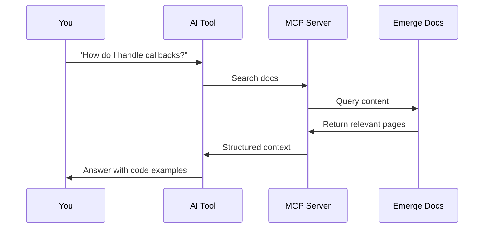

These docs are designed for AI-first workflows. Instead of searching the web or copying text, connect your AI tools directly to this documentation via MCP (Model Context Protocol).

## What's possible

<CardGroup cols={2}>
  <Card title="Ask questions" icon="message-question">
    "How do I query user search history?" → AI searches docs and returns the answer with code examples
  </Card>
  <Card title="Generate code" icon="code">
    "Generate Python code to create a signed link" → AI finds SDK page and provides working implementation
  </Card>
  <Card title="Understand concepts" icon="lightbulb">
    "What's the difference between sync and async queries?" → AI explains with context from the docs
  </Card>
  <Card title="Debug issues" icon="bug">
    "Why is my webhook signature invalid?" → AI finds troubleshooting info and suggests fixes
  </Card>
</CardGroup>

## How it works



The MCP server:
1. Receives search queries from your AI tool
2. Searches the documentation semantically
3. Returns relevant content with context
4. AI tool uses this to answer your question

## Benefits over web search

| Web Search | MCP Connection |
|------------|----------------|
| May find outdated content | Always current documentation |
| Results from multiple sources | Single source of truth |
| Generic code examples | Emerge-specific implementations |
| Manual copy/paste | Structured data for AI |

## Supported AI tools

<CardGroup cols={2}>
  <Card title="Claude" icon="message" href="/ai/mcp-setup#claude">
    Anthropic's Claude via desktop app or claude.ai
  </Card>
  <Card title="Cursor" icon="code" href="/ai/mcp-setup#cursor">
    AI-powered code editor
  </Card>
  <Card title="VS Code" icon="window" href="/ai/mcp-setup#vs-code">
    With Copilot or other AI extensions
  </Card>
  <Card title="Claude Code" icon="terminal" href="/ai/mcp-setup#claude-code">
    Claude CLI for terminal workflows
  </Card>
</CardGroup>

## Quick setup

Add the MCP server to your tool in one step:

<Tabs>
  <Tab title="Cursor">
    Add to `.cursor/mcp.json`:
    ```json
    {
      "mcpServers": {
        "Emerge": {
          "url": "https://emerge.mintlify.dev/mcp"
        }
      }
    }
    ```
  </Tab>
  <Tab title="Claude Code">
    ```bash
    claude mcp add emerge https://emerge.mintlify.dev/mcp
    ```
  </Tab>
</Tabs>

See [MCP Setup](/ai/mcp-setup) for detailed instructions for all tools.

## Contextual menu

Every page in these docs includes a contextual menu with one-click AI integrations. Look for the menu icon on any page to:

- Copy as Markdown for pasting into AI chats
- Open directly in Claude or ChatGPT
- Copy the MCP server URL

Learn more in [Contextual Menu](/ai/contextual-menu).
