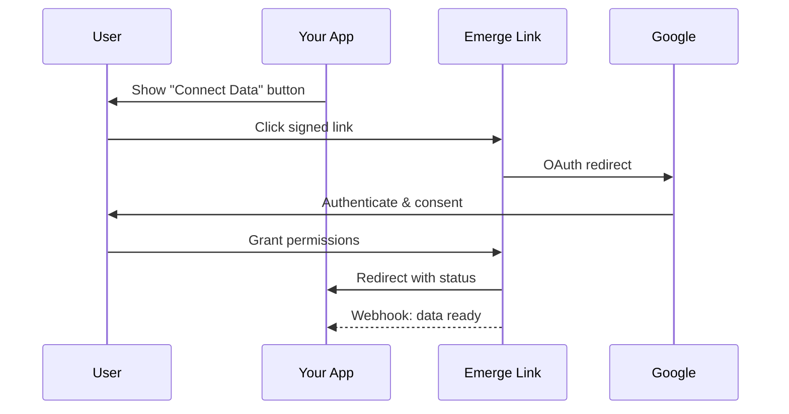

Emerge Link is a hosted consent flow that handles user authentication, consent collection, and data portability compliance. Users authenticate with their data provider (Google) and grant your application access to their data.

## How Link works

## Flow states

When a user completes (or exits) the consent flow, they're redirected to your `redirect_uri` with a `status` parameter:

| Status | Description |
|--------|-------------|
| `success` | First-time consent granted for this user |
| `reauthorized` | User re-linked an existing consent |
| `failure` | User cancelled or an error occurred |

## Try the demo

Experience the consent flow firsthand:

<Card title="Demo Link" icon="play" href="https://link.emergedata.ai/demotest">
  Open the demo consent flow (uses test credentials)
</Card>

## Integration steps

<Steps>
  <Step title="Get credentials">
    Sign up for the [Control Room](https://dashboard.emergedata.ai) and create your client credentials.
  </Step>
  <Step title="Configure your flow">
    Set your company name, logo, and redirect URIs via the API or Control Room.
  </Step>
  <Step title="Generate signed links">
    Create HMAC-signed URLs server-side to initiate the consent flow.
  </Step>
  <Step title="Handle callbacks">
    Process the redirect callback and verify the state parameter.
  </Step>
  <Step title="Set up webhooks">
    Receive notifications when user data is ready to query.
  </Step>
</Steps>

## What users see

The consent flow presents users with:

1. **Partner context** - Your company name and logo
2. **Data explanation** - What data will be shared and why
3. **Google OAuth** - Standard Google authentication
4. **Consent confirmation** - Explicit consent checkboxes

The flow is designed for compliance with GDPR, CCPA, and Google's data portability requirements.

## Next steps

<CardGroup cols={2}>
  <Card title="Authentication" icon="key" href="/link/authentication">
    Learn about API credentials and HMAC signing
  </Card>
  <Card title="Create Links" icon="link" href="/link/create-link">
    Generate signed consent URLs
  </Card>
</CardGroup>
